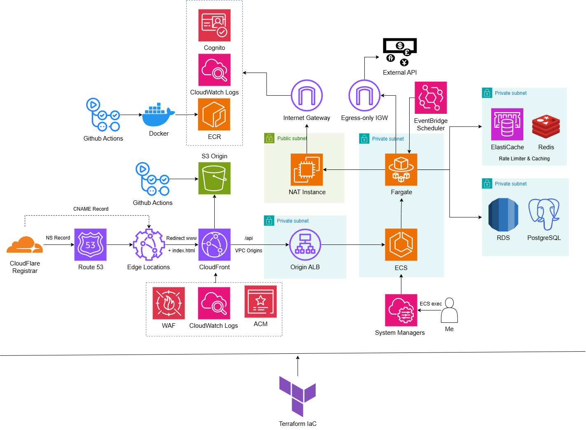

## Infrastructure of Expenner



## Modules

The infrastructure is divided into multiple modules and state files for better organization and maintainability. Each module is responsible for a specific part of the infrastructure. The modules are as follows:

- **00-prerequisites**: Contains the backend configuration for the terraform state file.
- **01-networking**: Contains the networking resources like VPC, Subnets, Security Groups, etc.
- **02-storage**: Contains the resources for the storage like S3, ECR, etc.
- **02a-cognito**: Contains the resources for Cognito User Pool.
- **03-web**: Contains the resources for the web application, like CloudFront, Route53, WAF, ALB, etc.
- **04-data**: Contains the resources for the database like RDS, ElastiCache, etc.
- **04a-jumpbox (optional)**: Contains the resources for the jumpbox instance to access the RDS resource, if needed. This module is optional because the RDS instance can also be accessed from the ECS task directly. See below.
- **05-application**: Contains the resources for the backend application like ECS.

## Environment-specific Configuration

- **02b-acm**: This module is environment-specific and contains the ACM certificate for the domain. Replace the `cloudflare_record` with `route53_record` in the `main.tf` file to use Route53 for DNS.
- **03a-cloudflare (optional)**: This module is optional and is used to configure the Cloudflare WAF if AWS WAF is not used.

## Considerations

NAT instance is used instead of NAT Gateway and VPC Endpoints for cost optimization. It allows the fargate tasks to access the AWS public services like ECR, S3, Cloudwatch, Cognito, and SSM without incurring additional costs.

## ECS exec

To access the ECS task via SSM agent, use the following command:

```bash
aws ecs execute-command  \
    --region <region> \
    --cluster <cluster-id> \
    --task <task-id> \
    --container <container-name> \
    --command "sh" \
    --interactive
```

## References

- [The Right way to structure Terraform Project!](https://ibatulanand.medium.com/the-right-way-to-structure-terraform-project-89a52d67e510)
- [Module creation - recommended pattern](https://developer.hashicorp.com/terraform/tutorials/modules/pattern-module-creation)
- [Terraform Best Practices](https://www.terraform-best-practices.com/)
